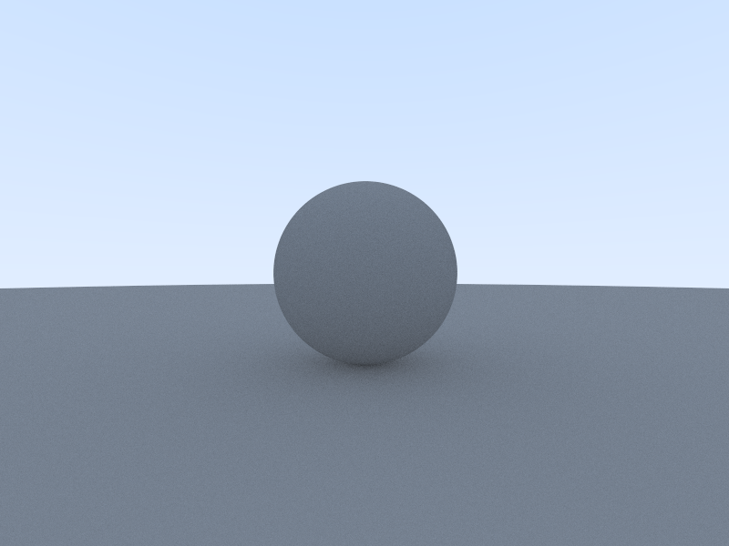
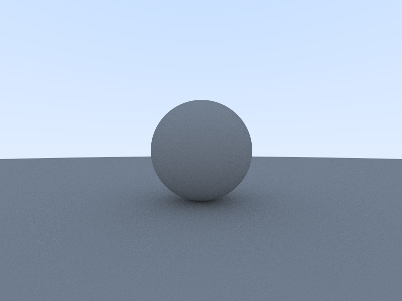
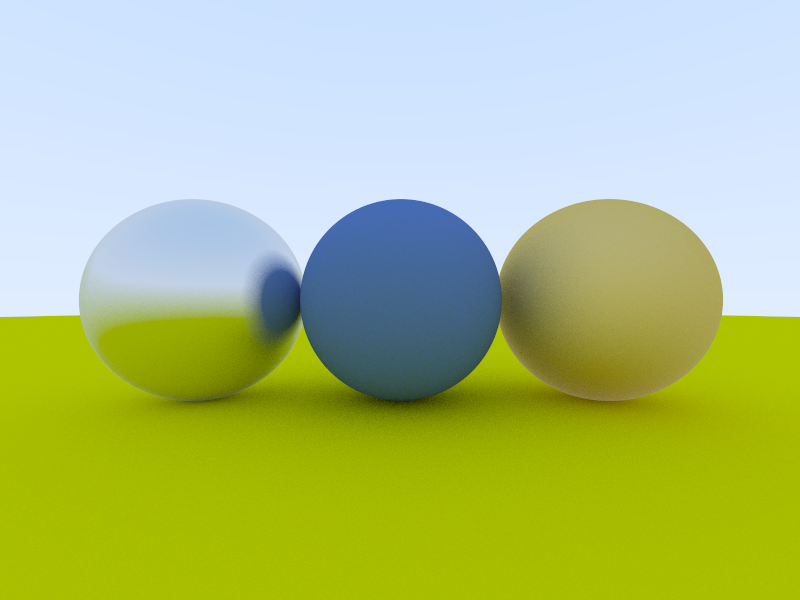
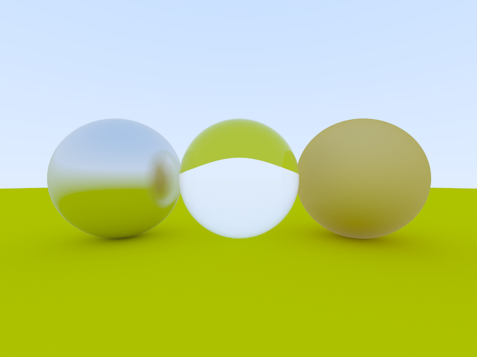

# PathTracerGallery

## First Render Result

## Antialiasing

| without antialiasing                      | with antialiasing (spp = 32)          |
|-------------------------------------------|---------------------------------------|
|   |  |

## Diffuse

| Uniform Hemisphere Distribution (spp = 256)  | Lambertian Distribution (spp = 256)   |
|----------------------------------------------|---------------------------------------|
|  |  |

## Metal

| Metal Material (spp = 256)                | 
|-------------------------------------------|
|  |

## Dielectric

| Dielectric Material (spp = 1024)                | 
|-------------------------------------------------|
|  |
